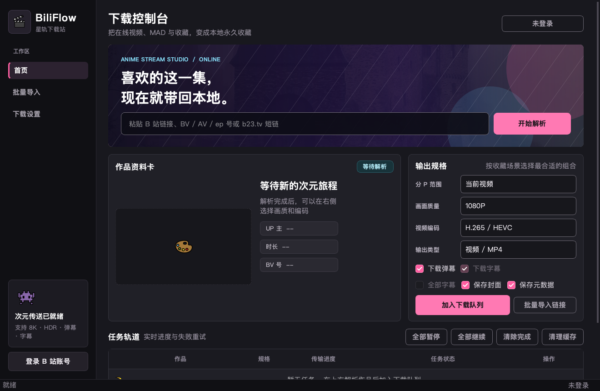

# BiliFlow / Bilibili Downloader

[](https://github.com/itsVicOC/bilibili-downloader/actions/workflows/ci.yml)
[](https://github.com/itsVicOC/bilibili-downloader/releases/latest)
[](LICENSE)

一款支持 GUI 和 CLI 的 B 站内容归档工具。可以解析视频、合集、系列与收藏夹，管理可跨重启恢复的任务，并将视频、音频、字幕、弹幕、封面和元数据保存到本地。



## 下载与安装

普通用户建议从 [GitHub Releases](https://github.com/itsVicOC/bilibili-downloader/releases/latest) 下载预构建包：

| 系统 | 下载文件 | 运行方式 |
|---|---|---|
| macOS 12+（Apple Silicon） | `BilibiliDownloader-macOS-full-<version>.zip` | 推荐；内置 FFmpeg，解压后打开应用 |
| macOS 12+（Apple Silicon） | `BilibiliDownloader-macOS-lite-<version>.zip` | 小体积版；需要另行安装 FFmpeg |
| Windows 10/11（x64） | `BilibiliDownloader-Windows-full-<version>.zip` | 推荐；内置 FFmpeg，完整解压后运行 |
| Windows 10/11（x64） | `BilibiliDownloader-Windows-lite-<version>.zip` | 小体积版；需要另行安装 FFmpeg |
| Linux | 暂无预构建包 | 按下方“从源码运行”操作 |

Release 同时提供 `SHA256SUMS.txt`。下载后可核对安装包完整性：

```bash
# macOS / Linux；将文件名替换为实际下载的安装包
shasum -a 256 BilibiliDownloader-macOS-full-vX.Y.Z.zip
```

```powershell
# Windows PowerShell
Get-FileHash .\BilibiliDownloader-Windows-full-vX.Y.Z.zip -Algorithm SHA256
```

将输出与同一 Release 中 `SHA256SUMS.txt` 的对应记录比较。

`full` 包内置一个从固定 FFmpeg 源码构建的最小 LGPL 版本，无需本地安装。`lite` 包、源码运行和 Linux 环境需要自行安装 FFmpeg：

- macOS：`brew install ffmpeg`
- Windows：`winget install Gyan.FFmpeg`
- Ubuntu / Debian：`sudo apt install ffmpeg`

如果 FFmpeg 不在系统 PATH 中，可在“下载设置”中直接选择其可执行文件。自定义路径优先于 full 包内置版本，因此两个版本都可以切换到其他 FFmpeg 构建。

Release 还提供 `FFmpeg-7.1-source.tar.gz`、各安装包的 CycloneDX SBOM 和统一校验文件。full 包内的 `FFMPEG-NOTICE.txt` 记录实际二进制摘要、构建参数与许可证。

> macOS 发布包目前未进行 Apple 公证。首次打开被系统拦截时，在“系统设置 → 隐私与安全性”中确认打开。请只从本仓库 Release 页面下载。

## 功能

- 支持 BV、AV、Bilibili 完整 URL、b23.tv 短链、UP 主合集/系列和收藏夹。
- 支持 240P 至 8K、HDR、Dolby Vision，以及 AVC、HEVC、AV1 编码选择。
- 自动选择匹配音轨，并通过 FFmpeg 无损封装为 MP4、仅音频 M4A 或 Hi-Res FLAC。
- 任务中心持久保存等待、暂停、失败和完成记录，异常退出后可继续断点下载。
- 支持多 P 单选或全选、来源预览筛选、规格去重、并发、全部暂停/继续和缓存清理。
- 支持弹幕转 ASS、首选或全部字幕转 SRT，并可保存封面和 JSON 元数据。
- 支持 `{author}/{collection}/{title}` 等安全目录模板。
- 支持 SESSDATA 登录；优先保存到系统凭据库。
- 网络解析、登录检查、封面加载与下载任务均在后台执行，避免阻塞界面。
- 日间/夜间主题跟随系统设置实时切换，无需重启。
- 提供二次元风格的 BiliFlow 桌面界面与跨平台应用图标。

日间界面预览：[docs/images/biliflow-light.png](docs/images/biliflow-light.png)。

## 快速使用

1. 启动 BiliFlow；lite 包或源码运行时先安装 FFmpeg。
2. 粘贴 BV/AV 号、视频 URL 或 b23.tv 短链，点击“开始解析”。
3. 选择画质、编码、视频/音频模式及归档附加项，加入任务中心。
4. 合集或收藏夹使用“批量导入”，解析后筛选要下载的作品。
5. 在“下载设置”中调整输出目录、目录模板和最大并发数。

部分高画质、会员内容或账号专属视频需要登录。详细操作、画质代码和配置位置见 [用户指南](docs/USER_GUIDE.md)。常见启动、解析、FFmpeg 与登录问题见 [故障排查](docs/TROUBLESHOOTING.md)。

## 从源码运行

需要 Python 3.10+ 与 FFmpeg：

```bash
git clone https://github.com/itsVicOC/bilibili-downloader.git
cd bilibili-downloader
python -m venv .venv
source .venv/bin/activate
python -m pip install -c constraints.txt -e ".[dev]"
python -m bilibili_downloader
```

Windows PowerShell 使用 `.\.venv\Scripts\Activate.ps1` 激活环境。

CLI 示例：

```bash
# 只解析元数据
python -m bilibili_downloader test BV1GJ411x7h7

# 下载整个可访问合集，按 UP 主和标题分目录，同时保存归档信息
python -m bilibili_downloader download \
  "https://space.bilibili.com/123/lists/456?type=season" \
  --quality 80 \
  --output ./downloads \
  --danmaku \
  --subtitle \
  --cover \
  --metadata \
  --path-template "{author}/{title}{part_suffix}" \
  --page all \
  --codec 12
```

运行 `python -m bilibili_downloader --help` 或阅读 [用户指南](docs/USER_GUIDE.md) 查看全部参数。

## 文档

| 文档 | 内容 |
|---|---|
| [用户指南](docs/USER_GUIDE.md) | GUI、CLI、登录、配置与数据存储 |
| [故障排查](docs/TROUBLESHOOTING.md) | 启动、解析、画质、FFmpeg 和网络问题 |
| [构建与发布](docs/BUILDING.md) | 开发环境、测试、打包和 Release 流程 |
| [贡献指南](CONTRIBUTING.md) | Issue、分支、代码质量与提交要求 |
| [安全策略](SECURITY.md) | 漏洞报告渠道与支持版本 |
| [第三方素材](THIRD_PARTY_NOTICES.md) | 图片、图标来源和许可证 |
| [更新日志](CHANGELOG.md) | 各版本新增、修改和修复内容 |

## 开发验证

```bash
pytest -q
python -m compileall -q bilibili_downloader tests
pyinstaller --noconfirm --clean BilibiliDownloader.spec
```

项目结构与完整构建说明见 [docs/BUILDING.md](docs/BUILDING.md)。

## 隐私与免责声明

- 应用不会把登录凭据发送到本项目维护者或任何自建服务器；请求只发往 Bilibili 及视频资源域名。
- SESSDATA 优先存储在系统凭据库。凭据库不可用时会回退到权限受限的本地配置文件。
- 本项目与哔哩哔哩（Bilibili）无隶属、授权或背书关系。
- 请仅下载你拥有权限的内容，并遵守当地法律、平台服务条款和内容版权要求。

## License

项目代码使用 [MIT License](LICENSE)。界面素材采用各自的许可证，详见 [THIRD_PARTY_NOTICES.md](THIRD_PARTY_NOTICES.md)。
