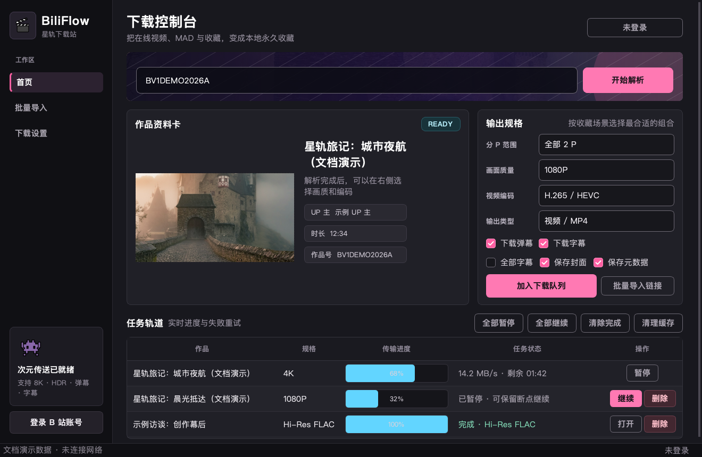
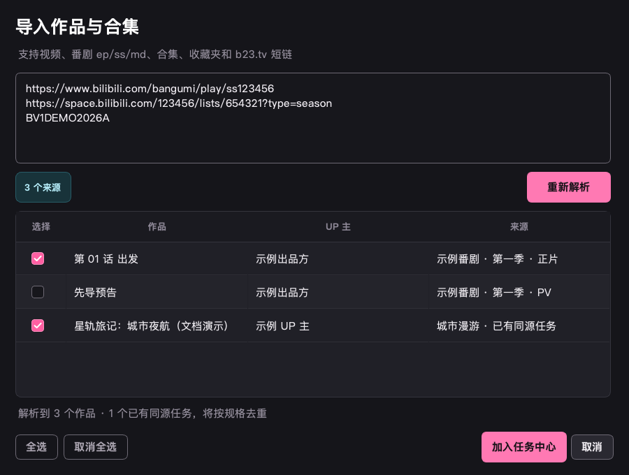
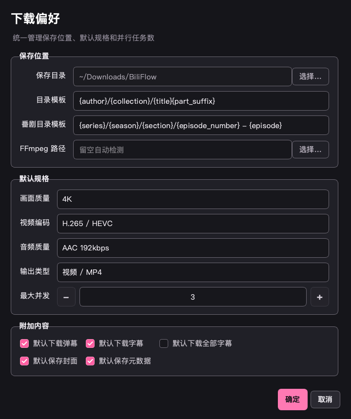
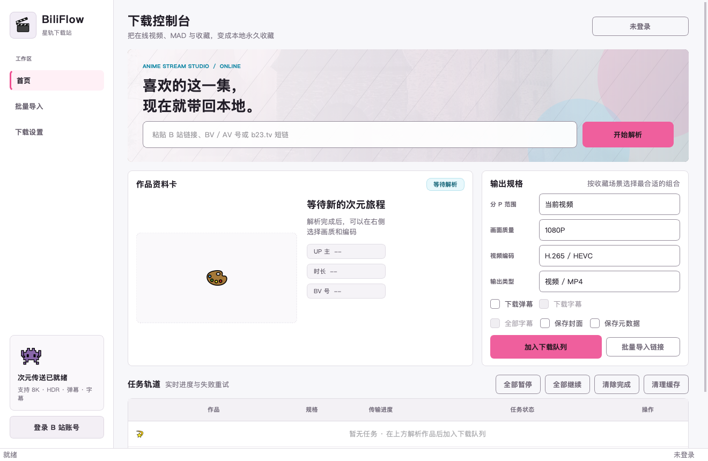
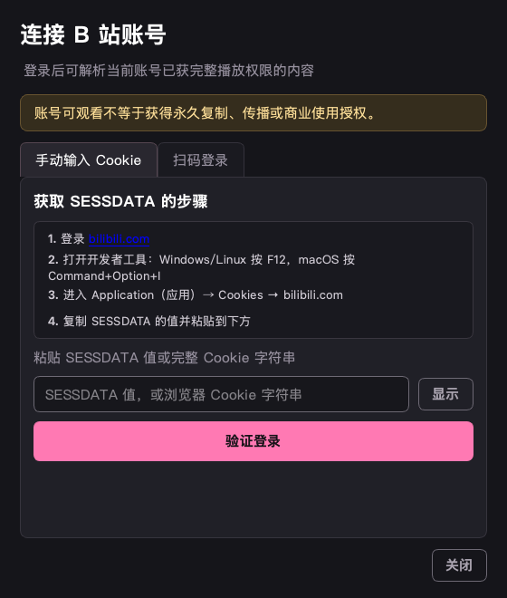

# BiliFlow / Bilibili Downloader

[](https://github.com/itsVicOC/bilibili-downloader/actions/workflows/ci.yml)
[](https://github.com/itsVicOC/bilibili-downloader/releases/latest)
[](docs/BUILDING.md)
[](LICENSE)

BiliFlow 是一款面向个人归档场景的 B 站桌面下载工具，同时提供 GUI 与 CLI。它可以解析视频、番剧、合集、系列和收藏夹，持久保存可恢复的任务，并将当前账号已获完整播放权限的未加密媒体流连同字幕、弹幕、封面和元数据保存到本地。


> BiliFlow 不会绕过会员、付费、地区、DRM 或账号权限。账号可观看不等于拥有永久复制、传播或商业使用权；使用前请阅读[版权与合规说明](docs/COPYRIGHT.md)。

## 项目亮点

| 能力 | 说明 |
|---|---|
| 多来源解析 | 支持 BV、AV、`ep/ss/md`、Bilibili 完整 URL、b23.tv 短链、UP 主合集/系列与收藏夹 |
| 完整媒体规格 | 支持 240P–8K、HDR、Dolby Vision，以及 AVC、HEVC、AV1；自动选择匹配音轨 |
| 本地归档 | 输出 MP4、M4A 或 Hi-Res FLAC，可同时保存 ASS 弹幕、SRT 字幕、封面与 JSON 元数据 |
| 可恢复任务中心 | 持久保存等待、暂停、失败和完成记录；异常退出后可继续断点下载 |
| 批量与多 P | 支持多 P 单选/全选、批量预览筛选、来源分页、精确去重和 1–8 路并发 |
| 安全登录 | 支持扫码或 Cookie 登录；只保留白名单字段，并优先写入系统凭据库 |
| 跨平台界面 | PySide6 桌面界面，支持 900×640 响应式布局，并实时跟随系统日间/夜间主题 |

## 界面预览

任务中心会集中显示实时速度、预计剩余时间、暂停/继续、部分完成警告和已完成记录。



<table>
  <tr>
    <td width="50%"></td>
    <td width="50%"></td>
  </tr>
  <tr>
    <td align="center">批量导入：解析、筛选与同源任务提示</td>
    <td align="center">下载设置：目录模板、规格与附加内容</td>
  </tr>
  <tr>
    <td width="50%"></td>
    <td width="50%"></td>
  </tr>
  <tr>
    <td align="center">跟随系统的日间主题</td>
    <td align="center">登录说明与敏感信息保护</td>
  </tr>
</table>

截图中的作品、任务和账号状态均为离线演示数据，不包含真实 Cookie、下载地址或媒体内容。

## 下载与安装

普通用户建议从 [GitHub Releases](https://github.com/itsVicOC/bilibili-downloader/releases/latest) 下载预构建包。`full` 包已经内置从固定源码构建的最小 LGPL FFmpeg，适合直接使用；`lite` 包体积更小，但需要系统另行安装 FFmpeg。

| 系统 | 下载文件 | 说明 |
|---|---|---|
| macOS 12+（Apple Silicon） | `BilibiliDownloader-macOS-full-<version>.zip` | 推荐；解压后打开应用 |
| macOS 12+（Apple Silicon） | `BilibiliDownloader-macOS-lite-<version>.zip` | 需要自行安装 FFmpeg |
| Windows 10/11（x64） | `BilibiliDownloader-Windows-full-<version>.zip` | 推荐；完整解压后运行 |
| Windows 10/11（x64） | `BilibiliDownloader-Windows-lite-<version>.zip` | 需要自行安装 FFmpeg |
| Linux | 暂无预构建包 | 按“从源码运行”操作 |

lite 包、源码运行和 Linux 环境可使用以下方式安装 FFmpeg：

- macOS：`brew install ffmpeg`
- Windows：`winget install Gyan.FFmpeg`
- Ubuntu / Debian：`sudo apt install ffmpeg`

如果 FFmpeg 不在系统 PATH 中，可以在“下载设置”中直接选择可执行文件。自定义路径优先于 full 包内置版本，因此 full 包也可以切换到其他 FFmpeg 构建。

<details>
<summary>校验安装包完整性</summary>

每个 Release 都提供 `SHA256SUMS.txt`。将命令输出与其中的对应记录比较：

```bash
# macOS / Linux
shasum -a 256 BilibiliDownloader-macOS-full-vX.Y.Z.zip
```

```powershell
# Windows PowerShell
Get-FileHash .\BilibiliDownloader-Windows-full-vX.Y.Z.zip -Algorithm SHA256
```

Release 还包含 FFmpeg 固定源码归档、各安装包的 CycloneDX SBOM 和统一校验文件。full 包内的 `FFMPEG-NOTICE.txt` 记录实际二进制摘要、构建参数与许可证。

</details>

> macOS 发布包默认未进行 Apple 公证；如果某个 Release 已签名并公证，会在该版本发布说明中明确标注。未公证版本首次打开被拦截时，请在“系统设置 → 隐私与安全性”中确认打开，并确保安装包来自本仓库 Release 页面。

## 五分钟上手

1. 启动 BiliFlow；使用 lite 包或源码运行时，先确认 FFmpeg 可用。
2. 在首页粘贴 BV/AV/ep 号、视频或番剧单集 URL、b23.tv 短链，然后点击“开始解析”。
3. 选择分 P、画质、编码、视频/音频输出和需要的归档附加项。
4. 点击“加入下载队列”，在任务中心查看进度或执行暂停、继续与打开文件。
5. 对于合集、收藏夹或番剧 `ss/md` 页面，打开“批量导入”，先解析预览，再筛选要加入的作品。
6. 第一次真正创建下载任务时阅读版权提示；确认后才会建立任务和媒体临时文件。

部分高画质、会员内容或账号专属视频需要登录。BiliFlow 只使用当前账号已经拥有的播放权限；接口只返回试看、地区受限、DRM 或无完整未加密流时会停止。

更完整的界面说明、任务状态、目录模板和配置位置见[用户指南](docs/USER_GUIDE.md)。遇到启动、解析、FFmpeg 或登录问题时查看[故障排查](docs/TROUBLESHOOTING.md)。

## 支持范围

| 来源 | 单个解析 | 批量导入 | 备注 |
|---|:---:|:---:|---|
| BV、AV、普通视频 URL | ✓ | ✓ | 支持多 P |
| 番剧 `ep` 单集 | ✓ | ✓ | 必须拥有完整播放权限 |
| 番剧 `ss/md` 季度或媒体页 | — | ✓ | 默认选择正片，PV/花絮/特别篇可手动加入 |
| UP 主合集与系列 | — | ✓ | 支持分页读取和筛选 |
| 收藏夹 | — | ✓ | 私密或账号专属内容需要登录 |
| b23.tv 短链 | ✓ | ✓ | 需要联网展开短链 |

国际站、课程、稍后再看、直播、动态、DRM、地区代理解析，以及任何付费、会员或账号权限绕过均不受支持。实际可用画质、编码、音轨和字幕由作品本身、当前账号权限及 Bilibili 接口响应共同决定。

## 从源码运行

需要 Python 3.10–3.12 与 FFmpeg：

```bash
git clone https://github.com/itsVicOC/bilibili-downloader.git
cd bilibili-downloader
python -m venv .venv
source .venv/bin/activate
python -m pip install -c constraints.txt -e ".[dev]"
python -m bilibili_downloader
```

Windows PowerShell 使用 `.\.venv\Scripts\Activate.ps1` 激活环境。

### CLI 示例

```bash
# 只解析元数据
python -m bilibili_downloader test BV1GJ411x7h7

# 下载当前账号可完整播放的番剧单集
python -m bilibili_downloader download ep123 --quality 80

# 整季默认只下载正片；需要附加章节时显式开启
python -m bilibili_downloader download \
  "https://www.bilibili.com/bangumi/play/ss123" \
  --include-extras

# 下载整个可访问合集，同时保存归档信息
python -m bilibili_downloader download \
  "https://space.bilibili.com/123/lists/456?type=season" \
  --quality 80 \
  --output ./downloads \
  --danmaku \
  --subtitle \
  --cover \
  --metadata \
  --path-template "{author}/{title}{part_suffix}" \
  --page all \
  --codec 12
```

运行 `python -m bilibili_downloader --help` 或阅读[用户指南的 CLI 章节](docs/USER_GUIDE.md#cli)查看全部参数。

## 文档

| 文档 | 适合谁 | 内容 |
|---|---|---|
| [文档中心](docs/README.md) | 所有人 | 按安装、使用、排障、开发和发布组织全部文档 |
| [用户指南](docs/USER_GUIDE.md) | 使用者 | GUI、CLI、登录、任务、配置与数据存储 |
| [故障排查](docs/TROUBLESHOOTING.md) | 使用者 | 启动、解析、画质、FFmpeg、登录与任务恢复 |
| [版权与合规说明](docs/COPYRIGHT.md) | 所有人 | 授权边界、禁止用途与权利人反馈 |
| [构建与发布](docs/BUILDING.md) | 开发者 | 开发环境、测试、截图、打包和 Release 流程 |
| [贡献指南](CONTRIBUTING.md) | 贡献者 | Issue、分支、代码质量与提交要求 |
| [安全策略](SECURITY.md) | 研究者 | 漏洞报告渠道与凭据处理边界 |
| [第三方素材](THIRD_PARTY_NOTICES.md) | 发行维护者 | 图片、图标、FFmpeg 来源和许可证 |
| [更新日志](CHANGELOG.md) | 所有人 | 各版本新增、修改和修复内容 |

## 开发验证

```bash
python -m compileall -q bilibili_downloader tests scripts
pytest -q
ruff check bilibili_downloader tests packaging_hooks scripts
git diff --check
```

涉及打包、资源路径或依赖变化时，再运行：

```bash
pyinstaller --noconfirm --clean BilibiliDownloader.spec
```

项目结构、文档截图生成方式与完整发布流程见[构建与发布](docs/BUILDING.md)。

## 隐私与免责声明

- 应用不会把登录凭据发送到项目维护者、自建服务器或媒体 CDN；Cookie 只发送给受信任的 Bilibili API/网页域名。
- 登录输入只保留白名单字段，并优先存储在系统凭据库。凭据库不可用时仅在当前进程内存中保留，重启后需要重新登录。
- 日志、任务数据库、元数据和文档截图不应包含有效 Cookie 或带签名的播放 URL。
- 本项目与哔哩哔哩（Bilibili）无隶属、授权、合作或背书关系。
- 请优先使用官方客户端提供的缓存能力，并遵守当地法律、平台服务条款和权利人许可。

## License

项目代码使用 [MIT License](LICENSE)。界面素材和发行包内 FFmpeg 继续适用各自许可证，详见 [THIRD_PARTY_NOTICES.md](THIRD_PARTY_NOTICES.md)。
