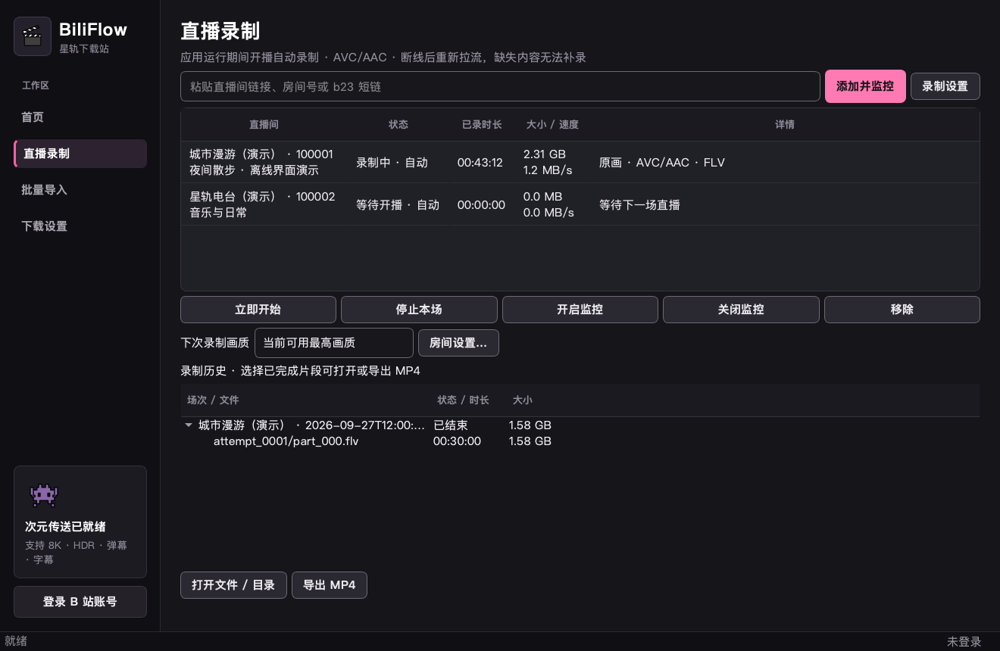
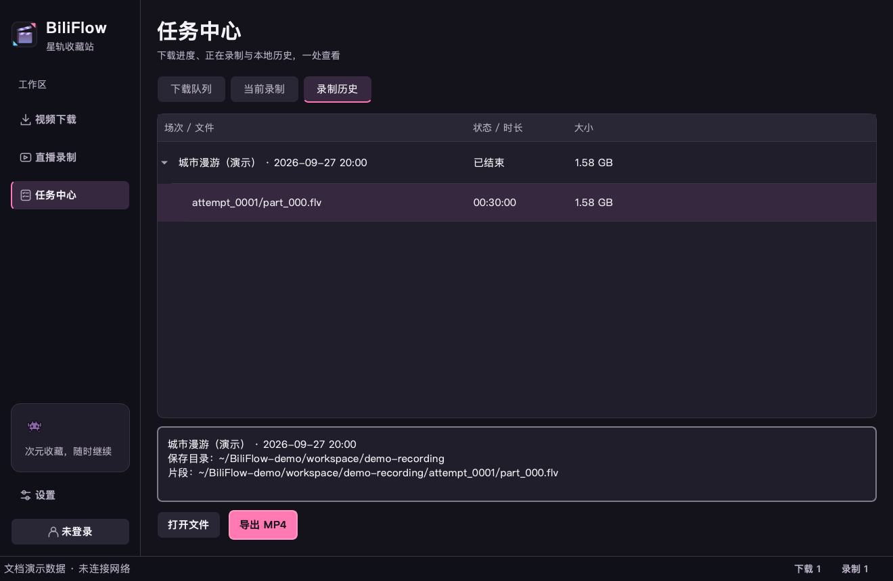

# 直播录制

## 使用

1. 打开侧边栏「直播录制」，输入房间号、直播间 URL 或指向直播间的 b23 短链，点击「添加并监控」。短房间号会转换成真实房间号并去重。
2. full 包自动寻找配套 `biliflow-recorder`；lite 包或源码运行可在「设置 → 工具与存储」选择自行构建的引擎。直播页的「录制设置」可直达统一设置。缺少引擎或版本不匹配会显示提示。
3. 「立即开始」可手动录制；「停止本场」保留自动监控但跳过当前场次；「关闭监控」停止录制且不再自动开始。重新开启监控或立即开始可撤销跳过。
4. 选择房间后，在详情卡查看状态、下次拉流画质、目录和分段时长。录制、重连与收尾期间无法移除房间或修改目录、分段；收尾时停止按钮禁用，避免重复提交。
5. 在「任务中心 → 当前录制」查看准备、排队、录制、重连、收尾及需要处理的房间，可「停止本场」或「查看房间」；需要处理时可直接「重试录制」。选中房间可查看具体原因。直播页与任务中心共享状态，切页不会启动第二个服务或中断录制。
6. 在「任务中心 → 录制历史」展开场次，选择已经封口且文件存在的片段，打开文件或「导出 MP4」。直播页右上角「录制历史」可直达。导出时显示处理状态并禁用重复导出，完成后可打开导出位置。无损转封装保留源文件，失败不会替换已有目标文件。



应用运行期间才会监控。退出时会停止并封口；睡眠或断网期间的内容无法补录。应用重新运行会恢复启用的订阅，中断场次保留在历史中，后续录制使用新的场次目录。

## 默认设置

| 设置 | 默认值 |
|---|---|
| 开播轮询 | 60 秒，随机偏移 ±10 秒；添加或启用后立即查询 |
| 并发 | 2 路，可设为 1–4 路，其他房间排队 |
| 分段 | 30 分钟；边界由引擎在媒体边界确定，可能略晚于设定时间 |
| 清晰度 | 当前账号可用最高档，同档优先 FLV，然后 HLS-TS、HLS-fMP4 |
| 编码 | 请求 AVC；当前验收范围为 H.264 + AAC |
| 断线重试 | 2、5、10、30、60 秒，重新查询播放地址；恢复稳定数据后重置退避 |
| 风控 | 至少 5 分钟冷却，重新启用或唤醒不会绕过冷却 |
| 下播确认 | 连续两次未开播，间隔至少 10 秒 |
| 空间保护 | 保留 2 GiB；每 5 秒检查，不足或目录失效时停止，处理后手动恢复 |
| 轮播 | 不录制 |

全局目录与分段时长作为新增房间的默认值。「房间设置」可修改已有房间的目录和分段时长，需要先停止并完成收尾。画质设置在下次获取直播流时生效；详情展示实际清晰度及回退原因。

默认设置位于「设置 → 直播」；保存后生效，撤销或放弃草稿不会改变运行设置。窄窗口将房间详情放在列表下方，主要操作始终固定在底部。状态包含文字、时长、大小与速度，录制没有百分比进度。

## 文件与历史

```text
录制目录/主播/真实房间号/UTC开始时间_唯一ID/
├── manifest.json
├── attempt_0001/part_000.flv
├── attempt_0001/part_001.flv
└── attempt_0002/part_000.ts
```

每次重新连接使用新的 `attempt` 目录。场次清单保存已关闭的文件、实际选择的清晰度、容器、编码、警告和录制缺口；未正常封口的文件保留在目录中，不冒充已完成片段。历史使用本地时间展示场次；异常场次会显示缺口和提示数量，选中后在下方读取完整说明。展开与选择在刷新后保留。



Mesio 固定版本的 FLV 元数据时长按整秒统计，界面时长可能有每段不足约 1 秒的舍入误差。HLS-fMP4 源文件保留直播解码时间轴，部分播放器可能显示较大的时间偏移；导出 MP4 可得到从文件起点播放的普通容器。媒体包完整性单独测试，不以容器时长字段代替。

公开直播间可在未登录时添加与查询，直播资料及播放信息请求使用 WBI 签名；公共签名密钥共享缓存，密钥失效时最多刷新重试一次。仍受限时显示风控或限流提示；已监控房间进入冷却，重新启用不会缩短冷却时间。账号登录决定可用画质与访问权限。

直播流支持 Bilibili 返回的 `*.v.smtcdns.net` 媒体 CDN，HLS 初始化文件与分片同样经过 HTTPS 与域名校验。单路播放地址或其子资源不受支持时，自动排除该线路并重新查询其他线路；签名刷新不会重复尝试同一条已拒绝线路。全部线路被拒绝后才显示「需要处理」，仍按正常间隔监测新场次；下次开播自动重新尝试。磁盘、权限或引擎配置问题仍需处理后手动重试。

账号 Cookie 仅用于直播 API 查询；媒体子进程通过标准输入获取临时播放地址，不接收 Cookie。数据库、场次清单和应用日志不保存完整签名播放地址。加密、付费及不可访问直播间不在首版范围内；普通功能标签不作为权限限制。付费标签按 [Bilibili 播放器接口说明](https://live.bilibili.com/p/html/bilibili-live-player/docs/web-player-common.roominfo.all_special_types.html) 判断。

## 开发与验证

生产引擎由 Mesio `mesio-v0.6.0` 的提交 `1897d736a4560f267700d7c4c1cf02dffc3c4c56` 构建。上游 `mesio-engine` crate 的版本是 `0.5.0`，与发布标签不同。依赖由 `native/recorder/Cargo.lock` 固定，发行构建使用 Rust 1.96.0。

```bash
cargo build --release --locked --manifest-path native/recorder/Cargo.toml
python -m bilibili_downloader
```

源码运行自动检测 `native/recorder/target/release/biliflow-recorder`（Windows 为 `.exe`）。协议与安全边界见 [原生适配程序说明](../native/recorder/README.md)。

离线媒体夹具需要完整 FFmpeg/ffprobe 来生成和检查测试媒体。只有带 `test-fixtures` 的测试构建允许从本机 HTTP 服务读取样本；应用和发行校验脚本会拒绝该构建。

```bash
cargo test --locked --manifest-path native/recorder/Cargo.toml
cargo build --locked --features test-fixtures --manifest-path native/recorder/Cargo.toml
python scripts/smoke_live_recorder.py --binary native/recorder/target/debug/biliflow-recorder
# 额外验证发行版最小 FFmpeg，生成和探测仍使用 PATH 中的完整版本：
python scripts/smoke_live_recorder.py --binary native/recorder/target/debug/biliflow-recorder \
  --remux-ffmpeg ffmpeg-build/output/ffmpeg
pytest -q
```

Windows 命令中的原生可执行文件增加 `.exe` 后缀。可加 `--work-dir <空目录>` 保留生成样本和录制输出。CI 在 macOS、Windows、Linux 上运行原生与媒体测试；Release 工作流再次测试录制与内置 FFmpeg，再打包生产构建。

## 发布验收状态（2026-09-28）

本次实现完成了 API、调度、持久化、原生进程协议、桌面入口和发行流水线。以下状态区分本机实测与待完成的发布验收，**当前不声明已满足正式发布门槛**。

| 项目 | 状态 |
|---|---|
| Python 单元、服务恢复和原有功能回归 | 本机通过 |
| 未登录添加 `21414905`、WBI 签名与公开直播流获取 | 本机 macOS API 实测通过；Windows 安装包录制复测待完成 |
| Rust 编译、Clippy、URL/播放列表策略测试 | 本机 macOS ARM64 通过 |
| FLV、HLS-TS、HLS-fMP4 分段、尾段、逐包完整性 | 本机生成样本通过 |
| 分辨率变化、FLV 时间戳重置、HLS discontinuity / init 更新 | 本机生成样本通过，变化前后媒体包数量一致 |
| 正常停止、父进程输入关闭、已封口文件保留 | 本机生成样本通过 |
| 最小 FFmpeg 本地 MP4 转封装，音视频轨及包数核对 | 本机通过；MPEG-TS 参数探测需要内置 AAC 解码组件 |
| full 引擎自检、Rust SBOM 与依赖许可证生成 | 本机通过 |
| macOS 冻结 CLI、full 包内置发现、ad-hoc 签名、签名后 SBOM 哈希 | 本机通过；不能替代 Developer ID 公证和真实直播验收 |
| 加密 HLS、外域子资源及事件中的签名地址保护 | 本机原生夹具通过 |
| 900×640 窗口、导航及重复实例保护 | 本机通过 |
| Windows x64 / macOS ARM64 冻结安装包实机录制 | 待验收；流水线已配置，不能用本机测试代替 |
| 两个真实直播间持续至少 8 小时、内存与界面响应 | 待验收 |
| 真实 CDN 失效、地址过期、系统睡眠、物理磁盘满 | 待实机故障注入；服务层对应状态转换已有模拟测试 |

### 正式发布前检查

- 两个平台均使用 full 包，在没有 Python/Rust 开发环境的机器上完成录制和导出；记录安装包 SHA-256、系统版本、测试日期。
- 同时录制两个有权保存的直播间至少 8 小时。每 30 分钟记录 Python 与两个录制进程的内存、界面响应、磁盘写入速度、片段数量，排查持续增长。
- 验证分段可独立播放，开头、中间、末尾均可定位；检查 MP4 的时长、H.264/AAC 轨和实际播放。
- 断网/恢复、切换 CDN、引擎强退、应用强退、睡眠唤醒后检查重试上限、无孤儿进程、恢复缺口和源文件保留；必要时用受控网络代理制造超时与过期地址。
- 在测试卷上模拟磁盘满和输出目录失效；恢复空间后手动重新开始，不能覆盖旧片段。
- 检查数据库（含 WAL）、清单、日志和进程参数中不存在 Cookie 与完整签名播放地址。
- 在发布记录中补充每项实测结果和失败样本。未通过的数据完整性问题必须先修复并重跑，不能仅修改此清单为“通过”。

首版没有直播弹幕、HEVC/AV1 验收、后台常驻服务、自动投稿和云录制。
